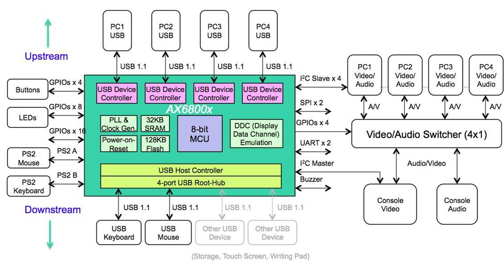

# [KVM简介](https://github.com/Qful/extHUB)

KVM：Keyboard Video Mouse

模拟 KVM 交换机系统直接连接任意计算机上的键盘、视频和鼠标。它提供完全独立于软件和网络操作系统的简易即插即用安装系统，并使用户能够对多台计算机进行实时访问。模拟 KVM 最适用于用户和系统处于同一位置的环境，是访问集中化多 PC 和多机架环境的理想技术。

KVM over IP将键盘、视频和鼠标数据数字化，并使用 IP 技术移动 KVM 数据。KVM over IP 直接连接至任意计算机上的 KVM 信号，无需侵入计算机，无需添加软件/硬件。该技术利用了现有网络基础设施，支持本地和远程用户。KVM over IP 在不同硬件环境中工作，是管理多地点数据中心和分支办公室的理想技术。

## [技术方案](https://github.com/Qful/extHUB)

### [asix USB KVM](asix/)

* [asix AX68004 4*USB](asix/)

### www.Qful.net